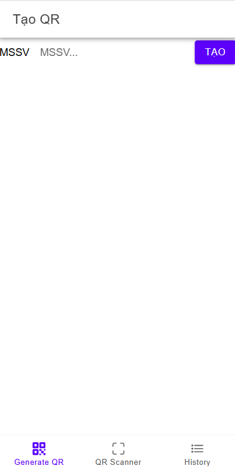
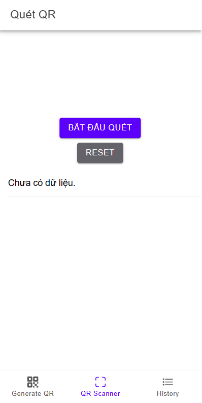
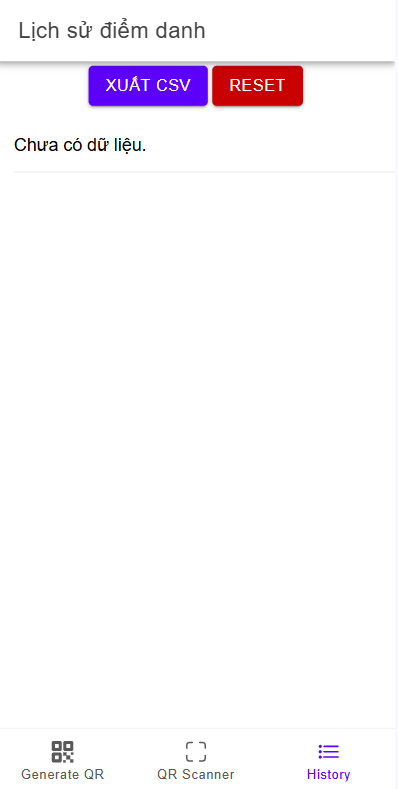

# QR Attendance

Ứng dụng điểm danh bằng mã QR, xây dựng với Ionic + React + Capacitor + Tailwind CSS.

## Tính năng chính
- **Tạo mã QR**: Nhập MSSV, tạo mã QR với định dạng `ATTEND:<MSSV>`.
- **Quét mã QR**: Sử dụng camera để quét, nếu đúng định dạng sẽ lưu MSSV và thời gian điểm danh.
- **Lịch sử điểm danh**: Xem danh sách các MSSV đã điểm danh cùng thời gian.
- **Xuất CSV**: Tải toàn bộ lịch sử điểm danh về máy.
- **Reset**: Xoá toàn bộ lịch sử điểm danh.

## Công nghệ sử dụng
- [Ionic React](https://ionicframework.com/docs/react)
- [Capacitor](https://capacitorjs.com/) (build mobile, truy cập camera...)
- [Tailwind CSS](https://tailwindcss.com/) (giao diện)
- [ZXing](https://github.com/zxing-js/library) (quét QR code)
- [qrcode.react](https://github.com/zpao/qrcode.react) (tạo QR code)

## Cấu trúc dự án
- `src/pages/GenerateQR.tsx`: Trang tạo mã QR
- `src/pages/QRScanner.tsx`: Trang quét mã QR và điểm danh
- `src/pages/History.tsx`: Trang lịch sử điểm danh, xuất CSV, reset
- `src/utils/storage.ts`: Quản lý lưu trữ và xuất dữ liệu
- `src/App.tsx`: Navigation, Ionic Tabs

## Hướng dẫn chạy
1. Cài đặt dependencies:
   ```bash
   npm install
   ```
2. Chạy ứng dụng:
   ```bash
   npm run dev
   ```
3. Build APK (yêu cầu Android Studio, Capacitor):
   ```bash
   npx cap sync android
   npx cap open android
   # Build và chạy trên thiết bị/emulator qua Android Studio
   ```


## Demo
1. tạo qr code


2. quét qr code


3. Lịch sử điểm danh


## Ghi chú
- Dữ liệu lưu localStorage (có thể chuyển sang SQLite nếu cần).
- Giao diện tối ưu cho mobile.
- Nếu không có quyền camera, ứng dụng sẽ báo lỗi.

---

Tác giả: DVanhoan
